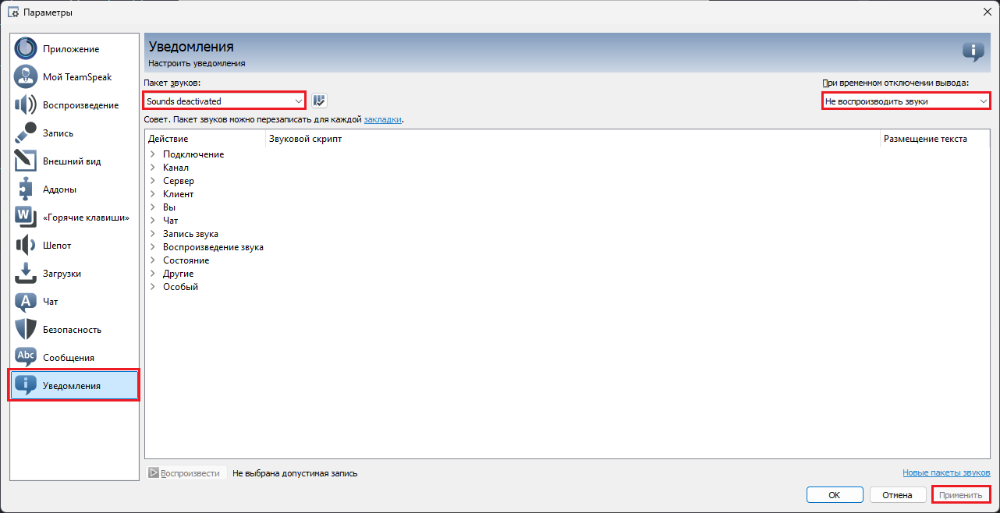
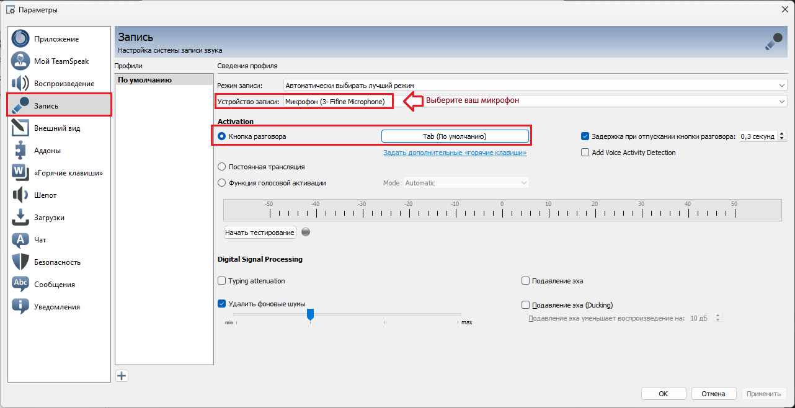

Перед началом игры вам необходимо:

- Лицензионная копия ArmA 3 (тут всё просто)
- Установить и настроить [Teamspeak](https://www.filehorse.com/download-teamspeak-client-64/57288/) и [Плагин](https://drive.google.com/file/d/1cjgmEm6q1YBam-dsSgpvoh8qb1Pyprc2/view) для него:
  - Скчайте и установите [Teamspeak 3.5.6](https://www.filehorse.com/download-teamspeak-client-64/57288/)
  - При запуске обязатенльно не нажимать обновить, иначе teamspeak перестанет корректно работать с ArmA 3
  - После того как вы запустите Teamspeak скачайте [Плагин](https://drive.google.com/file/d/1cjgmEm6q1YBam-dsSgpvoh8qb1Pyprc2/view) и запустите его при помощи Teamspeak (обычно файл запускается через Teamspeak по умолчанию), пройдите процедуру установки
  - После установки перезапустите Teamspeak, затем нажмите Ctrl+P. Откроется меню настроек. Затем сделайте всё как на скриншотах:
    
    
    
    
- ## Установить и войти в сеть [RadminVPN](https://www.radmin-vpn.com/ru/):
- Установить пресет модов
