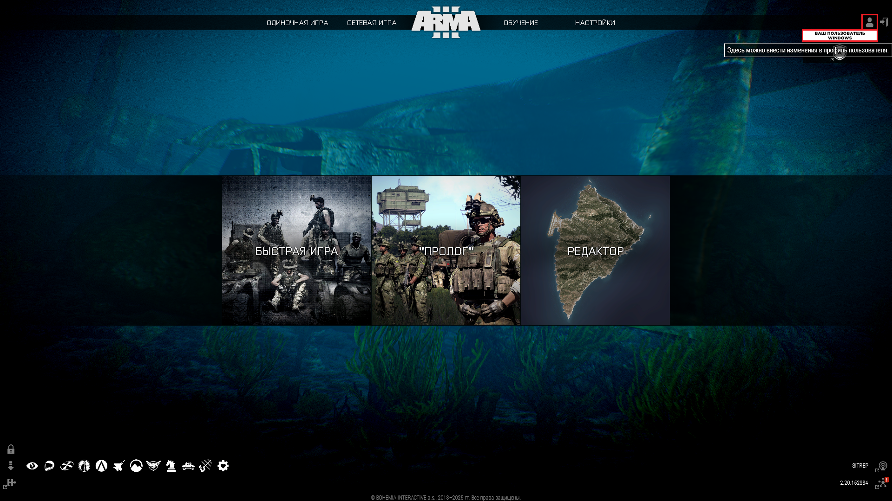
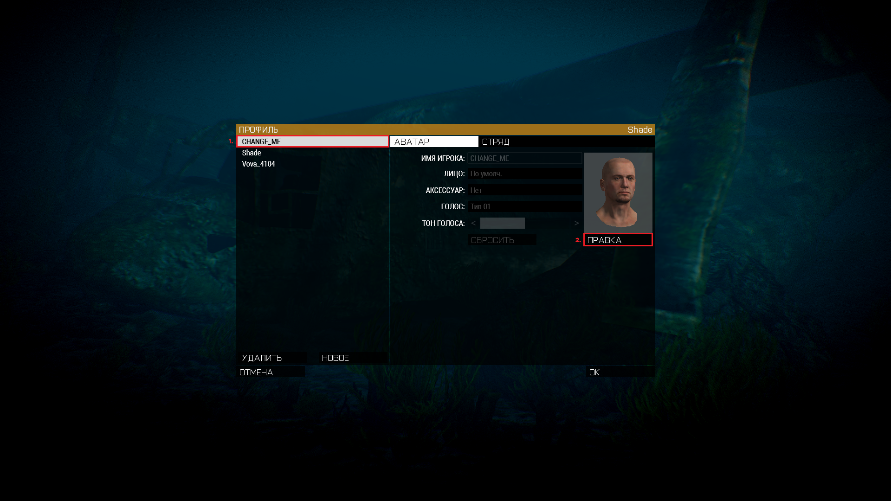
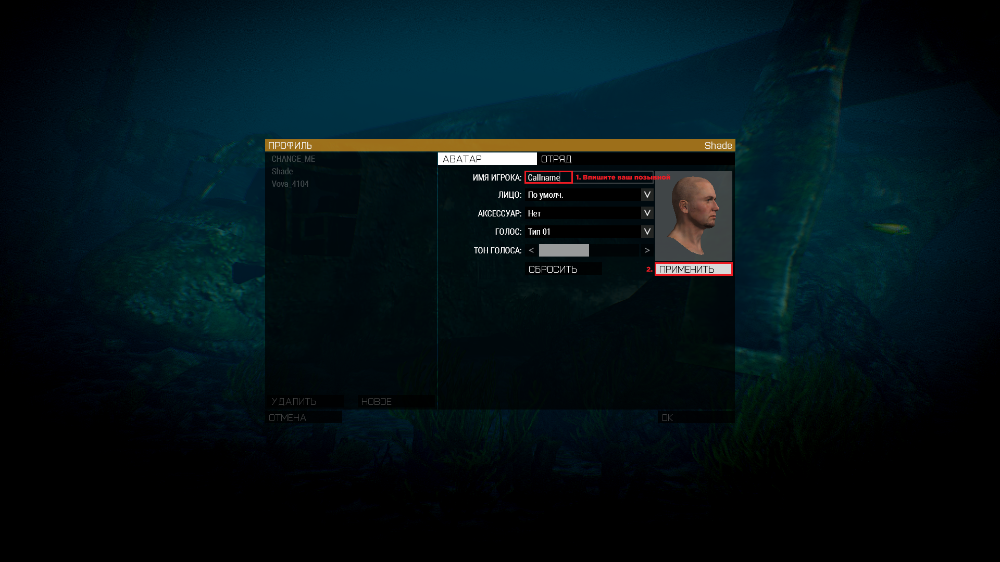
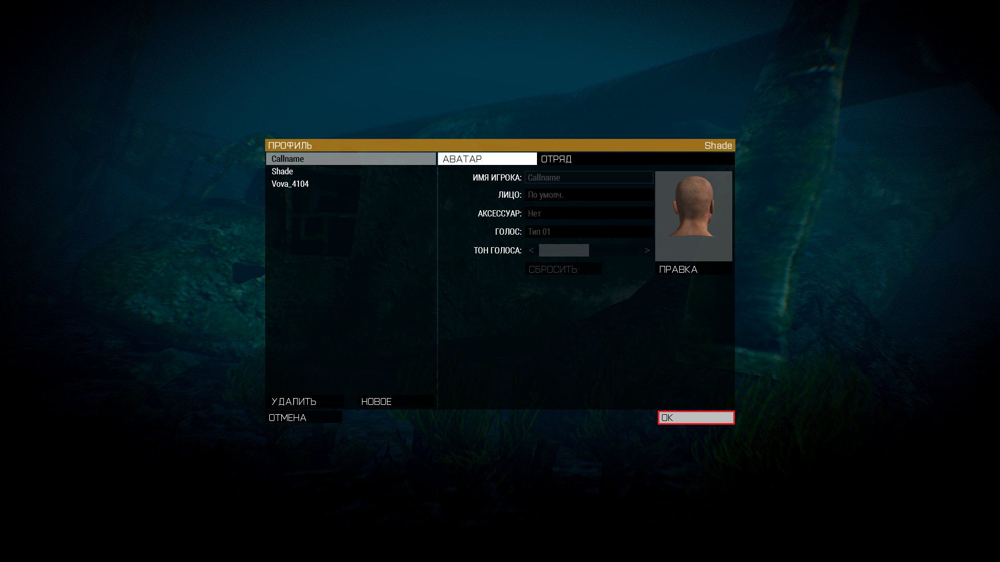

Перед началом игры вам необходимо:

- Лицензионная копия ArmA 3

1. Установить и настроить [Teamspeak](https://www.filehorse.com/download-teamspeak-client-64/57288/) и [Плагин](https://drive.google.com/file/d/1cjgmEm6q1YBam-dsSgpvoh8qb1Pyprc2/view) для него:

- Скчайте и установите [Teamspeak 3.5.6](https://www.filehorse.com/download-teamspeak-client-64/57288/). На этапе установки Owerwolf обязательно убираем галочку с "Установить Overwolf", также не следует нажимать кнопку обновления при запуске teamspeak для корректной работы с Arma 3
- После того как вы запустите Teamspeak скачайте [Плагин](https://drive.google.com/file/d/1cjgmEm6q1YBam-dsSgpvoh8qb1Pyprc2/view) и запустите его при помощи Teamspeak (обычно файл запускается через Teamspeak по умолчанию), пройдите процедуру установки.
- После установки перезапустите Teamspeak, затем нажмите Alt+P. Откроется меню настроек. Затем сделайте всё как на скриншотах:
  
  
  
  

2. Установить и войти в сеть [RadminVPN](https://www.radmin-vpn.com/ru/):

- Скачайте [RadminVPN](https://www.radmin-vpn.com/ru/)
- Нажмите Shift+= на вашей клавиатуре, и введите эти данные:

  Имя сети: VECTOR Project

  Пароль: VECTOR

3. Установить [пресет модов](data/VECTOR.html) *(Все моды займут около 55гб, и будут установлены на диск с ArmA. Да много, но игра без модов - неиграбельна, а на фоне других проектов 55гб - адекватная цифра.)*:

- Скачайте [пресет модов](data/VECTOR.html)
- Откройте ArmA 3 launcher и сделайте всё как на скриншотах. Также важно, что бы ваш steam не был в автономном режиме
  
  
  

4. Установить настройки игры:

- Перед выполнением остальных действий вам необходимо хотя бы один раз войти в игру
- Скачайте [архив с настройками](data/Settings.zip)
- Распакуйте содержимое (Папка **Arma 3 - Other Profiles**) в папку **Документы** (**Буква диска:\Users\Имя пользователя Windows\Documents**)
- Зайдя в ArmA сделайте всё как на скриншотах
  
  
  
  

# Готово. Теперь вы можете ждать анонс и начинать играть.
