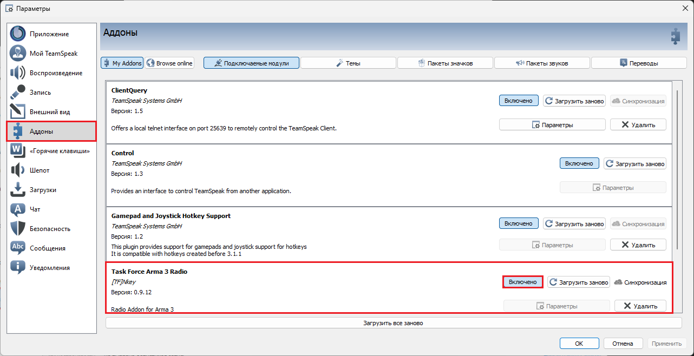
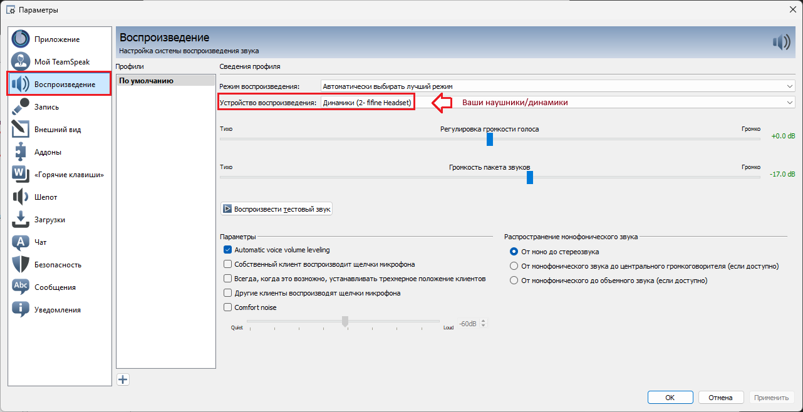
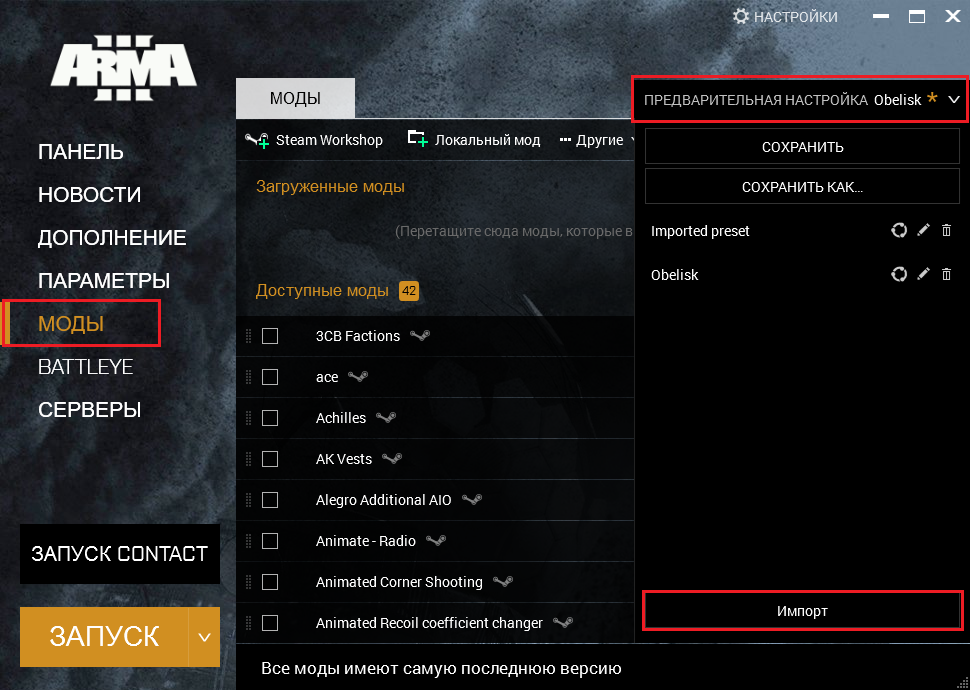
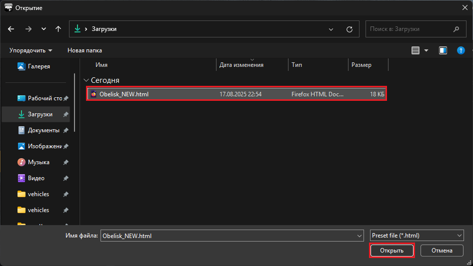
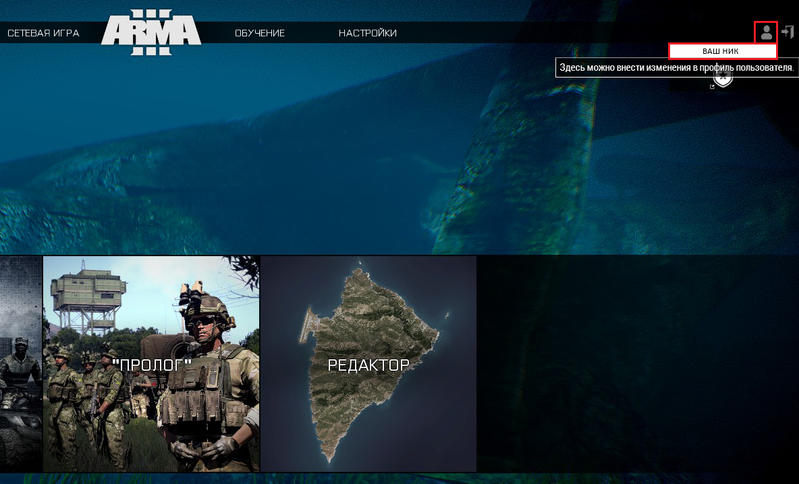

Перед началом игры вам необходимо:

- Лицензионная копия ArmA 3

1. Установить и настроить [Teamspeak](https://www.filehorse.com/download-teamspeak-client-64/57288/) и [Плагин](https://drive.google.com/file/d/1cjgmEm6q1YBam-dsSgpvoh8qb1Pyprc2/view) для него:

- Скчайте и установите [Teamspeak 3.5.6](https://www.filehorse.com/download-teamspeak-client-64/57288/)
- При запуске обязатенльно не нажимать обновить, иначе teamspeak перестанет корректно работать с ArmA 3
- После того как вы запустите Teamspeak скачайте [Плагин](https://drive.google.com/file/d/1cjgmEm6q1YBam-dsSgpvoh8qb1Pyprc2/view) и запустите его при помощи Teamspeak (обычно файл запускается через Teamspeak по умолчанию), пройдите процедуру установки. На этапе с Owerwolf обязательно убираем галочку с "Установить Overwolf"
- После установки перезапустите Teamspeak, затем нажмите Ctrl+P. Откроется меню настроек. Затем сделайте всё как на скриншотах:
  
  
  
  

2. Установить и войти в сеть [RadminVPN](https://www.radmin-vpn.com/ru/):

- Скачайте [RadminVPN](https://www.radmin-vpn.com/ru/)
- Нажмите Shift+= на вашей клавиатуре, и введите эти данные:
  Имя сети: Яяпо Нец
  Пароль: 02330233

3. Установить [пресет модов](data/Obelisk_NEW.html):

- Скачайте [пресет модов](data/Obelisk_NEW.html)
- Откройте ArmA 3 launcher и сделайте всё как на скриншотах. Также важно, что бы ваш steam не был в автономном режиме
  
  
  

4. Установить настройки игры:

- Перед выполнением остальных действий вам необходимо хотя бы один раз войти в игру
- Скачайте оба файла [отсюда](data/Settings/)
- Заменить в названии "ВАШ_НИК" на ваш позывной/никнейм, который будут видеть все игроки
- Если это название совпадает с названием вашего профиля windows, то закинуть эти файлы в "C:\Users\ВАШ ПОЛЬЗОВАТЕЛЬ WINDOWS\Documents\Arma 3", а если нет - в "C:\Users\ВАШ ПОЛЬЗОВАТЕЛЬ\Documents\Arma 3 - Other Profiles\ВАШ*НИК", где ВАШ*НИК - тот же, что был указан в названиях файлов профиля (если папка отсутствует - создайте)
- Зайдя в ArmA сделайте всё как на скриншотах
  
  

Готово. Теперь вы можете ждать анонс и начинать играть.
